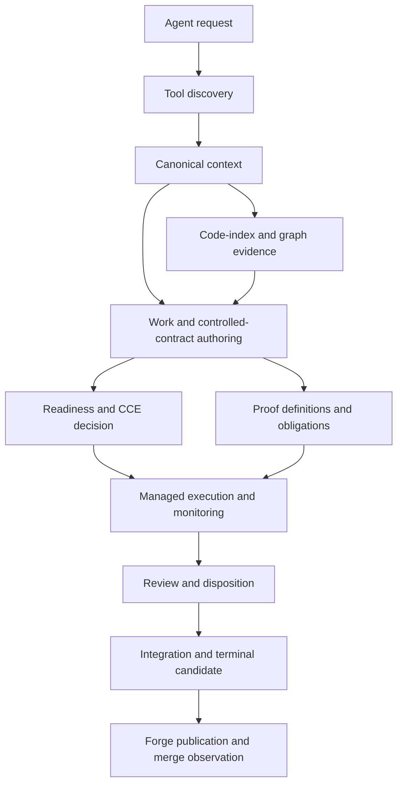

# Agent workflow architecture

Agent workflows are composed from domain-owned structured operations. There is
no universal workflow dispatcher, shared workflow database, or response
envelope that replaces those owners. Each operation defines its own authority,
inputs, effects, result vocabulary, recovery behavior, and durable evidence.

This page maps those current boundaries. Designs, plans, open questions, review
dispositions, implementation assignments, and lifecycle progress belong in
canonical work records.

## Composition

The arrows show information flow, not automatic authorization. A result from
one domain can supply authenticated input to the next domain, but it does not
transfer the first operation's authority or grant the next effect.

## Discovery

Tool discovery is the authority for runtime availability, request schemas,
side effects, support state, and durable documentation pointers. Agents call a
known supported capability directly and use `workspace_tools_list`,
`workspace_tools_describe`, or the advisory router when the capability or its
contract is not already known. Registered handlers,
manifest entries, examples, executable files, and remembered tool names do not
establish support independently of discovery.

Discovery results describe the current runtime and role. Managed agents receive
only launcher-selected capabilities, so a coordinator cannot infer a worker's
tool set from its role name or prompt.

See [Tool Discovery v1](tool-discovery.md) and
[MCP integration](mcp-integration.md).

## Canonical context

Durable system knowledge lives in `docs/`. Canonical coordination, controlled
work contracts, decisions, initiatives, sources, and area indexes live in the
wiki. Generated catalogs and views are retrieval aids rather than independent
authority.

Natural-language retrieval starts from the wiki catalog and structured wiki
search. Selected reads preserve the source and selection identity needed to
interpret their content. Code-index and graph-impact results supplement this
context with implementation paths, likely tests, and structural relationships;
they do not override durable documentation or accepted decisions.

See [MCP repository model](mcp-repository-model.md) and
[Work-record persistence](work-record-persistence.md).

## Work and contract authoring

A canonical JSON work record is the unit of coordination for one lifecycle and
closure story. Structured work-record operations own allocation, semantic
updates, validation, slicing, and lifecycle transitions. Shell edits and
conversation text do not substitute for those operations.

Controlled acceptance contracts and proof obligations are separate canonical
carriers with semantic authoring operations. Design meaning is authored before
executable shaping. Mechanically derived identifiers, mappings, dependent
updates, and publication effects remain server-owned. An agent supplies genuine
semantic choices and does not reconstruct canonical payloads or authority
fields.

See [MCP Operation Reference](mcp-operation-reference.md),
[Controlled-contract operations](mcp-controlled-contract-operations.md), and
[Acceptance-coverage MCP](acceptance-coverage-mcp.md).

## Readiness and execution

Local wiki operations validate structure and record facts but do not authorize,
refuse, or certify lifecycle readiness. CCE owns action sequencing and
admissibility. Mechanical failures and policy decisions remain distinct, as
defined by [decision](../wiki/decisions/decision.md).

Managed implementation and findings-only runs start through structured dispatch.
The launcher resolves the exact repository generation, role, model, confinement,
read scope, write scope, and exposed capabilities. Runtime monitoring and
completion use the lifecycle routes returned for that run. Shell launchers and
operator examples do not provide agent dispatch authority.

See [Enforcement Model](enforcement-model.md),
[Agent-launch confinement and MCP conduit](agent-launch-confinement-mcp-conduit.md),
and [MCP dispatch managed run lifecycle](mcp-dispatch-managed-run-lifecycle.md).

## Proof, review, and evidence

Proof definitions describe prospective verification meaning. Proof execution
and its observations remain runtime-owned. Authored definitions, selected proof
applications, executable evidence, and acceptance conclusions are distinct
facts.

Review and redteam results are advisory evidence. Their exact run, reviewed
subject, base, candidate, and disposition remain bound to their owning
lifecycle. Review findings do not authorize implementation or veto integration,
and historical findings are not rewritten after disposition.

Graph, review, proof, and runtime evidence retain their native identities.
Compact projections preserve complete-result counts and an operative retrieval
path when they omit allowed content. One domain's digest does not authenticate
facts added by another domain.

See [MCP dispatch terminal review](mcp-dispatch-terminal-review.md) and
[decision](../wiki/decisions/decision.md).

## Integration and delivery

Implementation delivery, slice integration, terminal-candidate construction,
terminal review, forge publication, merge observation, and work-record
completion are separate effects. Each is reported only by its owning operation.

Integration is how a managed delivery reaches the persistent work reference.
Terminal review examines the exact whole-work candidate. Forge handoff publishes
that already-reviewed candidate byte-for-byte against the configured base and
creates or observes its pull request; it does not merge or complete the work
record. Forge-confirmed merge evidence gates final completion.

See [Slice integration](mcp-dispatch-slice-integration.md),
[Terminal review](mcp-dispatch-terminal-review.md), and
[Work-record persistence](work-record-persistence.md).

## State and recovery

There is no global transaction spanning canonical authoring, a managed run,
integration, and forge state. Each operation owns its atomic boundary and
settlement vocabulary. Cross-boundary continuations carry owner-produced
bindings and revalidate them at the next effect boundary.

Callers follow the status, refusal, recovery action, and supported next call
returned by the owning operation. They do not infer whether an effect happened
from a transport error, replay an indeterminate mutation, repair completed
review evidence, or transfer authority between operations.

Current contract revisions create new execution generations under
[decision](../wiki/decisions/decision.md). Earlier candidate, run, proof, and
review evidence stays historical and is not silently credited to the new
generation.

## Resource and information boundaries

Each domain owns its byte, count, pagination, consistency, capacity, and
retention limits. Structured outputs are lossless through complete projection,
ranged retrieval, or pagination. Truncation does not redefine the result.

Live source-bound reads may refuse when their source moves. Frozen result
snapshots preserve the identity and content of their original evaluation.
These consistency models are intentionally different and remain explicit in
the owning response.

Agent-visible evidence excludes authority the caller is not entitled to
possess. Server-owned graph preparation, canonical publication, review
provenance, and forge state remain behind their structured operations rather
than being downloaded, modified, and uploaded by the agent.
