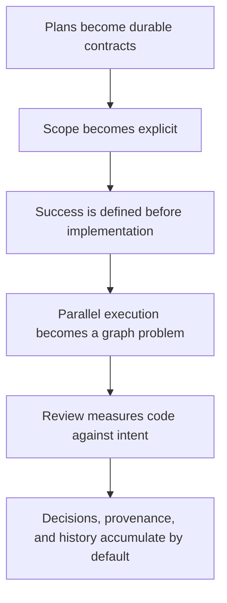

# AgentChassis

Coding agents rely on private, ephemeral context. As sessions grow, that
context shifts, compresses, and degrades.

The code survives.

The reasoning does not.

AgentChassis starts with one rule:

**The agent that defines the work cannot implement it.**

What this rule forces:



**AgentChassis turns agentic coding into agentic engineering.**

## What it is

AgentChassis is a system you install into your own repository. It splits agent
coding work into three roles that are not allowed to overlap:

- an **orchestrator** plans the work and breaks it into small, scoped tasks, but
  never writes product code itself;
- **workers** each implement one task, confined to the files that task is
  allowed to change;
- **reviewers** check each change against what its task said it should do.

Every task is a written **work record** — its contract. The record states the
scope, the acceptance criteria, and how to validate the result, all before any
code is written. Nothing reaches your codebase without one.

Because implementation has to pass through this loop, your repository builds up
an engineering record — what was planned, why, who did it, and whether it
passed — as an ordinary byproduct of getting work done. That constraint is the
product: it forces work to become explicit before it runs, reviewable before it
closes, and durable after the session ends.

## Why this exists

Long-running AI coding agents drift away from declared scope on multi-file work
([Evaluating Goal Drift in Language Model Agents, 2025](https://arxiv.org/abs/2505.02709)),
degrade as context grows
([Coding Agents are Effective Long-Context Processors, 2026](https://arxiv.org/abs/2603.20432)),
and still resolve fewer than half of long-horizon software-engineering tasks
([SWE-Bench Pro, 2025](https://arxiv.org/abs/2509.16941)).

Better prompts do not close that gap. Agent execution is non-deterministic and
path-dependent, so what an agent actually does at runtime cannot be fully
governed at design time by prompts or static access controls. Runtime-governance
research points to the same answer: enforce constraints on the execution path
itself, with pre-action gates and runtime monitors, rather than relying on
instructions or after-the-fact checks
([Runtime Governance for AI Agents: Policies on Paths, 2026](https://arxiv.org/abs/2603.16586);
[MI9: Runtime Governance for Agentic AI, 2025](https://arxiv.org/abs/2508.03858);
[SARC: Governance-by-Architecture, 2026](https://arxiv.org/abs/2605.07728)).

AgentChassis applies that principle to coding work: every task has a written,
canonical contract; execution is contained to the declared scope; and the result
is reviewed against the contract. If a task has no well-formed contract, it is
rejected before any code is written. Unsupervised execution needs a boundary
regardless of how capable the model is.

## What it gives you

- **Interrupted work resumes cleanly.** A stalled or failed task carries its full
  definition in its record, so another agent — or you — can pick it up later
  without rebuilding lost context from a chat log.
- **Parallel agents don't collide.** Because every task declares which files it
  may touch, several agents can work at once on non-overlapping parts of the
  codebase.
- **Reviews are grounded, not guesswork.** A reviewer checks the change against
  the task's written acceptance criteria instead of inferring what was intended.
- **Malformed work is refused early.** A task missing scope, acceptance, or
  validation is rejected before any model runs — a fast, deterministic check, not
  a judgment call.
- **It isn't tied to one AI vendor.** The same setup drives multiple agent tools
  (Codex, Claude, and more), so you're not locked to a single model or provider.
- **Agents get a structured interface.** They work through typed tools — an MCP
  server with built-in discovery — rather than guessing at your files and
  conventions. The command line is an operator fallback, not the primary path.

## Free and hosted tiers

**Free, local, and complete.** The source-available tier runs entirely on your
machine — no account, API key, or network service. You get the full working
system: the work-record contracts, the check that rejects a malformed task
before any model runs, local sandbox enforcement of each task's file scope (on
Linux, via `bwrap`), review records tied to the exact change they reviewed, a
graph of your code for impact analysis, an MCP server your agents call directly,
and a launcher for orchestrators. Install one public npm package (no `.npmrc` or
auth required), run setup, build the code index, and point an orchestrator at
your repo.

**Hosted governance (private beta).** The **Chassis Control Engine (CCE)** adds
org-level policy that lives outside any single repo: it decides whether a given
piece of agent work is allowed to run at all, and returns a signed attestation
when it is. Teams that need central admission and audit across many repos use it;
solo and local use never require it. Request access:
https://forms.gle/YBJc1TnxoEPea3kx6

## Enforcement posture

"Enforced" means AgentChassis actively contained a run to its declared file
scope, rather than merely asking the agent to stay inside it. Whether that
happens depends on two separate questions:

- **Can it enforce?** Backend availability decides whether AgentChassis can
  enforce scope locally. When a supported isolation backend (Linux `bwrap`
  today) is active, worker, reviewer, and redteam runs are contained to their
  declared write scope and recorded as `enforced=true`.
- **Must it enforce?** A configured Chassis Control Engine (CCE) key decides
  whether AgentChassis is allowed to continue when enforcement is unavailable.
  The CCE key does not add sandboxing capability — it selects the governed
  posture. Local/free use never requires a CCE key.

| Mode | No usable backend | Backend available |
| --- | --- | --- |
| **No CCE key** | Best-effort local execution: dispatch may run **unenforced**, recorded loudly as `enforced=false`, `isolation_backend=none`. | Enforced; `enforced=true`. |
| **CCE key configured** | Enforcement is required, so dispatch **refuses** unless the operator sets the explicit unsandboxed opt-out; either way provenance records `enforced=false`. | Enforced; `enforced=true`. |

Every run records whether it was enforced and which backend, if any, was used.
Free/local mode never claims containment it does not have, and a CCE-key run
never silently degrades to unenforced. This is structured admissibility and
honest provenance, not a guarantee that a hostile or compromised agent is
harmless — see [docs/enforcement-model.md](docs/enforcement-model.md) for the
threat-model limits.

## Install and set up

First-time setup starts with the package install, then follows the detected
setup option printed by npm. For command details, see
[docs/quickstart.md](docs/quickstart.md).

### 1. Install AgentChassis

From your repo root:

Installed `@agent-chassis/*` package usage supports Node.js 22 or newer. Run the
install, bootstrap, wiki MCP, and agent-launch commands with a Node 22+ runtime.

```bash
npm install --save-dev @agent-chassis/core
```

`@agent-chassis/core` is the normal public install package. It provides the
`wiki` binary for bootstrap, validation, lint, generated views, and the code
index; the `wiki-mcp` stdio MCP server agents call for structured repo/wiki
operations; and the `agent-launch` human/operator entrypoint.

The package postinstall hook performs best-effort detection for supported local
agent CLIs (`claude` and `codex`) and prints only the matching setup choices. It
is guidance only: it does not run bootstrap, copy templates, create or modify
`AGENTS.md` or `agent-launch.toml`, initialize launcher config, build the code
index, launch an orchestrator, alter repo or client configuration, or fail
installation when detection fails.

### 2. Run first-time setup

Run the setup command from your repo root:

```sh
npx agent-chassis setup
```

The setup command runs bootstrap, asks for or detects the local agent family,
copies the matching launcher template when `agent-launch.toml` is absent, runs
`agent-launch init-config`, and prints the next code-index and orchestrator
commands. It does not copy `AGENTS.md`; review
`wiki/templates/AGENTS.md.boilerplate.md` and adapt it into this repo's root
operating contract before committing setup.

Bootstrap seeds the local wiki contract surfaces, the owned `IN-0001` adoption
initiative, the `WK-0001` adoption tracker, local cache directories, `.gitignore`
entries, the gitignored `wiki/.wiki-mcp.json` workspace declaration, and the
initial lexical search index. It is idempotent: rerunning preserves your edits
and only fills in missing surfaces. Bootstrap and postinstall do not execute
the setup commands: the operator creates or adapts `AGENTS.md`, copies or
reviews `agent-launch.toml`, and runs `agent-launch init-config` before the
first orchestrator launch. `agent-launch init-config` provisions the launcher
registry and role-guard secret that role dispatch requires.

The code index is required for normal operation. Normal readiness, dispatch
review, graph-impact, and review tooling depend on it. Build it after reviewing
and committing the bootstrap output. Root `AGENTS.md` and `agent-launch.toml`
are operator first-run prerequisites for `agent-launch orchestrator IN-0001`;
they are not worker-owned `WK-0001` setup slices. The first orchestrator launch
omits `--app`; family selection comes from the copied `agent-launch.toml` role
model unless an operator explicitly overrides it outside this setup flow. For
enforced Linux dispatch, put `bwrap` on your PATH. Whether a run without a usable
backend proceeds unenforced or refuses depends on whether a CCE key is configured
— see [Enforcement posture](#enforcement-posture),
[docs/quickstart.md](docs/quickstart.md), and
[docs/enforcement-model.md](docs/enforcement-model.md).

## Day-to-day operator commands

Run these from your repo root after installing `@agent-chassis/core`. These are
human/operator entrypoints — agents do not launch orchestrators. Orchestrator
commands are **interactive** and stay attached to your terminal until you end the
session — they are not background jobs. Attached does not mean hands-on: once
launched, an orchestrator routinely runs on its own for hours, and the attached
session is there so you can watch progress and step in, not because it needs
constant input.

```bash
# Start an initiative orchestrator (interactive; stays attached).
npx agent-launch orchestrator IN-0001 --model gpt-5.5
npx agent-launch orchestrator IN-0001 --model opus

# Resume an existing orchestrator session (interactive; stays attached).
npx agent-launch resume IN-0001 --model gpt-5.5
npx agent-launch resume IN-0001 --model opus

# List orchestrator runtime records.
npx agent-launch orchestrator list --json
```

## What your repo keeps

- product source code
- repo-specific docs
- local `wiki/` work records, initiatives, decisions, and sources
- local schema extensions and repo policy
- package installation and MCP client configuration

## Distribution

AgentChassis is a public, source-available project (Elastic License 2.0).
The `@agent-chassis/*` packages are published to the public npm registry under
the `@agent-chassis` scope and install with a plain `npm install` (no `.npmrc`
or auth required). Package-specific README roadmaps are generated from canonical
work records and remain the active per-package roadmap source of truth.

## License

Source-available under the Elastic License 2.0 — see [LICENSE](LICENSE).

## Documentation

Canonical, durable documentation lives under [`docs/`](docs/); per-package
roadmaps are generated into each package README.

### Getting started

- [docs/quickstart.md](docs/quickstart.md) — first setup walkthrough and the
  role-dispatch enforcement and opt-in posture.
- [docs/package-install.md](docs/package-install.md) — package roles and install detail
- [docs/local-package-install.md](docs/local-package-install.md) — installing
  the packages from a local build.
- [docs/adoption.md](docs/adoption.md) — adopting the contract in a new or
  existing repo.

### Operating and enforcement model

- [docs/operating-model.md](docs/operating-model.md) — the shared-substrate vs.
  local-repo boundary, and why this repo exists.
- [docs/enforcement-model.md](docs/enforcement-model.md) — the two-product
  enforcement posture, backend-enforced vs. unenforced run provenance, and the
  rationale behind it.
- [docs/versioning.md](docs/versioning.md) — the version stability contract.

### Agent interface

- [docs/mcp-integration.md](docs/mcp-integration.md) — wiring an MCP client over
  stdio.
- [docs/mcp-operation-reference.md](docs/mcp-operation-reference.md) — reference
  for the MCP operations agents call.
- [docs/tool-discovery.md](docs/tool-discovery.md) — how agents discover tools
  and the tool-authority vocabulary.

### Launcher and dispatch

- [docs/agent-launch-quickstart.md](docs/agent-launch-quickstart.md) — launcher
  and role-dispatch reference.
- [docs/agent-launch-operator-entrypoints.md](docs/agent-launch-operator-entrypoints.md)
  — operator entrypoints, with migration notes for retired wrapper scripts.

### Records and coordination reference

- [docs/work-record-ontology.md](docs/work-record-ontology.md) — work-record
  schema and field semantics.
- [docs/initiative-status.md](docs/initiative-status.md) — the coordinator
  triage lens over initiatives.
- [docs/areas.md](docs/areas.md) — area-based wiki structure.
- [docs/consumer-owned-docs.md](docs/consumer-owned-docs.md) — docs owned by the
  consuming repo.
- [docs/wiki-contract-metadata.md](docs/wiki-contract-metadata.md) — the
  `wiki/.wiki-contract.json` schema.

**Agents / agentic tools:** start at [docs/README-agents.md](docs/README-agents.md) for the retrieval order, rationale, and live per-package roadmaps.

## Further reading

- **Drift, context, and long-horizon limits:** [Evaluating Goal Drift in Language Model Agents, 2025](https://arxiv.org/abs/2505.02709), [Coding Agents are Effective Long-Context Processors, 2026](https://arxiv.org/abs/2603.20432), [SWE-Bench Pro, 2025](https://arxiv.org/abs/2509.16941)
- **Runtime governance:** [Runtime Governance for AI Agents: Policies on Paths, 2026](https://arxiv.org/abs/2603.16586), [MI9: Runtime Governance for Agentic AI, 2025](https://arxiv.org/abs/2508.03858), [SARC: Governance-by-Architecture, 2026](https://arxiv.org/abs/2605.07728)
